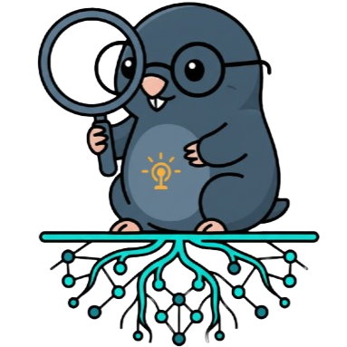
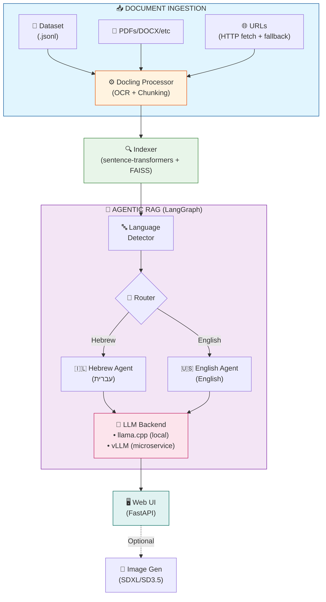
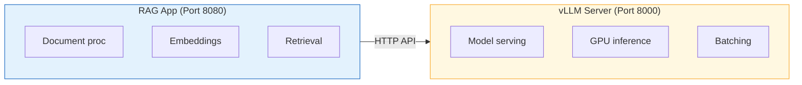

<div align="center">
  
  
  # **RAGroot** - *Academic Research Assistant*
  
  A fully self-contained Retrieval-Augmented Generation (RAG) system with **Agentic Architecture** for querying multi-format documents using local LLMs and vector search. Supports **Hebrew** and **English** with automatic language detection.
</div>

## 🚀 Features

- **Agentic RAG Architecture**: LangGraph-powered workflow with specialized Hebrew and English agents
- **Multi-Format Document Support**: PDF, DOCX, PPTX, XLSX, HTML, images via IBM Docling
- **Bilingual Support**: Automatic Hebrew/English language detection with language-specific responses
- **Fully On-Premise**: All core components run locally inside Docker
- **Offline Operation**: All embedding models can be stored locally for air-gapped deployment
- **Vector Search**: FAISS-based semantic search with sentence-transformers
- **Local LLM**: Llama-3.2-3B-Instruct-Q4_K_M or Qwen3-4B for efficient CPU inference
- **Web UI**: Clean, modern interface for querying and viewing results
- **REST API**: `/answer` and `/stream` endpoints for programmatic access
- **Smart Indexing**: Automatic detection of dataset changes with hash-based caching
- **URL Processing**: Robust HTTP fetching with retries and fallback extraction
- **OCR Support**: Tesseract and RapidOCR for scanned documents
- **Bonus: Image Generation**: Optional integration with local model (SDXL/SD3.5), Pollinations.ai (free), or OpenAI DALL-E

## 📋 Requirements

- **Docker** (with at least 4GB RAM allocated)
- **CPU**: Works on CPU (4+ cores recommended)
- **GPU**: Optional, for faster inference
- **Disk Space**: ~35GB for Docker image (include all models)

## 🏗️ Architecture



### LLM Backend Options

The RAG application supports two LLM backends:

1. **llama.cpp** (default) - Local GGUF models, runs inside the app container
2. **vLLM** - External microservice for larger models (recommended for production)

#### vLLM Microservice Architecture

For production or when using larger models like DictaLM, vLLM runs as a separate microservice:



Configure via environment variables:
- `LLM_BACKEND=vllm` - Use vLLM backend
- `VLLM_API_URL=http://localhost:8000/v1` - vLLM server URL
- `VLLM_API_TOKEN=` - Optional auth token (empty for local)

### Agentic RAG Architecture (New!)

The system uses **LangGraph** for workflow orchestration with specialized agents:

1. **Language Detection Router** - Automatically detects if query is Hebrew or English
2. **Hebrew Agent** - Processes Hebrew queries and responds in Hebrew (עברית)
3. **English Agent** - Processes English queries and responds in English
4. **DSPy Integration** - Optimized prompt generation for concise, citation-rich answers


**Key Features:**
- Automatic language detection based on Unicode character analysis
- Language-specific system prompts for culturally appropriate responses
- Shared retrieval system with language-aware response generation
- Support for mixed-language documents with Hebrew and English content

### Document Processing with Docling (New!)

Supported document formats via IBM Docling:

| Format | Extensions | OCR Support |
|--------|------------|-------------|
| PDF | `.pdf` | ✅ Tesseract/RapidOCR |
| Word | `.docx`, `.doc` | N/A |
| PowerPoint | `.pptx`, `.ppt` | N/A |
| Excel | `.xlsx`, `.xls` | N/A |
| HTML | `.html`, `.htm` | N/A |
| Images | `.png`, `.jpg`, `.tiff` | ✅ |
| Markdown | `.md` | N/A |
| URLs | `http://`, `https://` | ✅ (with fallback) |

**Fallback Extraction:** When Docling OCR fails, the system automatically falls back to PyMuPDF for robust PDF text extraction (especially good for Hebrew embedded fonts).

## 🛠️ Quick Start

### 1. Build the Docker Image

```bash
# Clone or create the project directory
mkdir genai-rag && cd genai-rag

# Add all the code files (main.py, indexer.py, retriever.py, image_gen.py, index.html)

# Build the image
docker build -t navedanan/genai-app:latest .
```

### 2. Run the Application

**Option A: With local llama.cpp (smaller models)**
```bash
docker run --rm -p 8080:8080 \
  -e DATA_PATH=/data/arxiv_2.9k.jsonl \
  -v $(pwd)/arxiv_2.9k.jsonl:/data/arxiv_2.9k.jsonl:ro \
  navedanan/genai-app:latest
```

**Option B: With vLLM microservice (larger models, recommended)**

Using docker-compose (easiest):
```bash
# Start both vLLM and RAG app together
docker compose -f docker-compose.vllm.yml up -d

# Or start vLLM separately
docker compose -f docker-compose.vllm.yml up -d vllm

# Then run RAG app pointing to vLLM
docker run --rm -p 8080:8080 \
  -e LLM_BACKEND=vllm \
  -e VLLM_API_URL=http://host.docker.internal:8000/v1 \
  -v $(pwd)/uploads:/app/uploads \
  -v $(pwd)/index:/app/index \
  ragroot:latest
```

Using standalone vLLM:
```bash
# Start vLLM server (requires GPU)
vllm serve dicta-il/DictaLM-3.0-Nemotron-12B-Instruct-W4A16 \
  --port 8000 \
  --trust-remote-code \
  --max-model-len 4096 \
  --gpu-memory-utilization 0.85

# Run RAG app with vLLM backend
docker run --rm -p 8080:8080 \
  -e LLM_BACKEND=vllm \
  -e VLLM_API_URL=http://host.docker.internal:8000/v1 \
  -e LLM_MODEL_NAME=dicta-il/DictaLM-3.0-Nemotron-12B-Instruct-W4A16 \
  ragroot:latest
```

### 3. Access the Application

Open your browser and navigate to:
```
http://127.0.0.1:8080
```
### 4. Jsonl Structure Example
```bash
{
    "id": "2509.21245v1", 
    "submitter": "Team Hunyuan3D", 
    "authors": "Team Hunyuan3D, :, Bowen Zhang, Chunchao Guo, Haolin Liu, Hongyu Yan, Huiwen Shi, Jingwei Huang, Junlin Yu, Kunhong Li, Linus, Penghao Wang, Qingxiang Lin, Sicong Liu, Xianghui Yang, Yixuan Tang, Yunfei Zhao, Zeqiang Lai, Zhihao Liang, Zibo Zhao", 
    "title": "Hunyuan3D-Omni: A Unified Framework for Controllable Generation of 3D Assets", 
    "comments": "Technical Report; 3D Generation", 
    "journal-ref": "", 
    "doi": "", 
    "categories": "cs.CV cs.AI", 
    "abstract": "Recent advances in 3D-native generative models have accelerated asset creation for games, film, and design. However, most methods still rely primarily on image or text conditioning and lack fine-grained, cross-modal controls, which limits controllability and practical adoption. To address this gap, we present Hunyuan3D-Omni, a unified framework for fine-grained, controllable 3D asset generation built on Hunyuan3D 2.1. In addition to images, Hunyuan3D-Omni accepts point clouds, voxels, bounding boxes, and skeletal pose priors as conditioning signals, enabling precise control over geometry, topology, and pose. Instead of separate heads for each modality, our model unifies all signals in a single cross-modal architecture. We train with a progressive, difficulty-aware sampling strategy that selects one control modality per example and biases sampling toward harder signals (e.g., skeletal pose) while downweighting easier ones (e.g., point clouds), encouraging robust multi-modal fusion and graceful handling of missing inputs. Experiments show that these additional controls improve generation accuracy, enable geometry-aware transformations, and increase robustness for production workflows.", 
    "source": "arxiv"
}
```
## 📁 Project Structure

```
RAG_PDF/
├── Dockerfile                      # Docker configuration
├── docker-compose.yml              # Docker Compose configuration
├── docker-compose.dev.yml          # Development Docker Compose
├── docker-compose.vllm.yml         # vLLM microservice configuration
├── requirements.txt                # Python dependencies
├── pyproject.toml                  # Python project configuration
├── README.md                       # This file
├── DEPLOYMENT_CHECKLIST.md         # Deployment checklist
├── PERFORMANCE_ANALYSIS.md         # Performance benchmarks
├── main.py                         # FastAPI application (v2.0)
├── data/
│   └── arxiv_2.9k.jsonl           # Dataset file
├── Documentation/
│   ├── ARCHITECTURE.md             # System design and components
│   ├── CONFIGURATION.md            # Configuration options
│   ├── DOCKER_DEPLOYMENT.md        # Docker deployment guide
│   ├── DOCLING_RAG.md              # Docling integration guide
│   ├── IMAGE_GENERATION.md         # Image generation setup
│   ├── LATEX_UTILS.md              # LaTeX utilities documentation
│   ├── OFFLINE_SETUP.md            # Offline/air-gapped deployment
│   └── QUICKSTART.md               # Quick start guide
├── index/
│   ├── chunks.json                 # Document chunks storage
│   ├── documents.json              # Document metadata
│   ├── document_hashes.json        # Hash-based change detection
│   ├── embeddings.npy              # Cached embeddings
│   └── faiss.index                 # FAISS vector index
├── models/
│   ├── Llama-3.2-3B-Instruct-Q4_K_M.gguf  # Main LLM model
│   ├── llama-model.gguf            # Symlink to active LLM
│   ├── Qwen3-4B-Instruct-2507-Q4_K_M.gguf # Alternative LLM
│   ├── embeddings/                 # Embedding models cache
│   ├── sdxl-turbo/                 # SDXL Turbo model
│   └── stable-diffusion-3.5-medium/ # SD 3.5 Medium model
├── static/
│   ├── index.html                  # Web UI
│   └── generated_images/           # Generated images cache
├── tests/
│   ├── evaluate_rag.py             # RAG evaluation tests
│   ├── test_api.py                 # API endpoint tests
│   ├── test_image_gen.py           # Image generation tests
│   ├── test_sd35_local.py          # SD 3.5 local tests
│   └── test_sd35.py                # SD 3.5 tests
├── tools/
│   ├── docker_build.ps1            # Docker build script (PowerShell)
│   ├── docker_build.sh             # Docker build script (Bash)
│   ├── download_models.py          # Model download utility
│   ├── sample_generator.py         # Sample data generator
│   └── validate_offline.py         # Offline setup validator
├── uploads/                        # Uploaded documents storage
└── utils/
    ├── __init__.py                 # Utils package init
    ├── agentic_rag.py              # Agentic RAG with LangGraph
    ├── config.py                   # Configuration management
    ├── document_processor.py       # Docling document processing
    ├── encoders.py                 # Text encoding utilities
    ├── image_gen.py                # Image generation utilities
    ├── indexer.py                  # Vector indexing (FAISS)
    ├── latex_utils.py              # LaTeX processing utilities
    └── retriever.py                # RAG pipeline with LLM
```

## 🔧 Configuration

### Environment Variables

| Variable | Default | Description |
|----------|---------|-------------|
| `DATA_PATH` | `/data/arxiv_2.9k.jsonl` | Path to dataset file |
| `INDEX_DIR` | `/app/index` | Directory for vector index |
| `LLM_BACKEND` | `llama_cpp` | LLM backend: `llama_cpp` or `vllm` |
| `MODEL_PATH` | `/app/models/llama-model.gguf` | Path to LLM model (for llama_cpp) |
| `VLLM_API_URL` | `http://localhost:8000/v1` | vLLM server URL (for vllm backend) |
| `VLLM_API_TOKEN` | (empty) | Auth token for vLLM (empty for local) |
| `LLM_MODEL_NAME` | `dicta-il/DictaLM-3.0-Nemotron-12B-Instruct-W4A16` | Model name for vLLM |
| `IMAGE_API_PROVIDER` | `pollinations` | Image generation provider |
| `IMAGE_API_KEY` | (empty) | API key for OpenAI (if using) |

### Image Generation Setup (Optional)

#### Option 1: Pollinations.ai (Default, Free)
No configuration needed! It works out of the box.

```bash
docker run --rm -p 8080:8080 \
  -e DATA_PATH=/data/arxiv_2.9k.jsonl \
  -v $(pwd)/arxiv_2.9k.jsonl:/data/arxiv_2.9k.jsonl:ro \
  navedanan/genai-app:latest
```

#### Option 2: OpenAI DALL-E
Requires an OpenAI API key:

```bash
docker run --rm -p 8080:8080 \
  -e DATA_PATH=/data/arxiv_2.9k.jsonl \
  -e IMAGE_API_PROVIDER=openai \
  -e IMAGE_API_KEY=sk-your-api-key-here \
  -v $(pwd)/arxiv_2.9k.jsonl:/data/arxiv_2.9k.jsonl:ro \
  navedanan/genai-app:latest
```

## 📡 API Endpoints

### POST `/answer`
Query the system and get a complete answer.

**Request:**
```json
{
  "query": "What are recent advances in transformers?",
  "generate_image": false,
  "top_k": 5
}
```

**Response:**
```json
{
  "answer": "Recent advances in transformers include...",
  "citations": [
    {"doc_id": "2509.01234", "title": "A New Approach to Transformers", "authors": "..."}
  ],
  "retrieved_context": ["Abstract text..."],
  "image_url": null,
  "detected_language": "english",
  "agent_used": "English Agent"
}
```

### POST `/stream`
Stream the answer generation (Server-Sent Events).

>[!NOTE]
>Because of curl's buffering behavior, It buffers the output and doesn't display Server-Sent Events (SSE) in real-time. This is a common problem with streaming endpoints. for real-time update use CLI command with --stream flag

```bash
curl -X POST http://localhost:8080/stream \
  -H "Content-Type: application/json" \
  -d '{"query": "Tell me about neural networks"}'
```

### GET `/health`
Check system health and statistics.

```bash
curl http://localhost:8080/health
```

### GET `/stats`
Get indexing statistics.

```bash
curl http://localhost:8080/stats
```

### POST `/upload`
Upload and process a document (PDF, DOCX, etc.).

```bash
curl -X POST http://localhost:8080/upload \
  -F "file=@document.pdf" \
  -F "language=auto"
```

**Response:**
```json
{
  "status": "success",
  "document_id": "abc123...",
  "filename": "document.pdf",
  "chunks_created": 15,
  "detected_language": "hebrew"
}
```

### POST `/process-url`
Process a document from a URL.

```bash
curl -X POST http://localhost:8080/process-url \
  -H "Content-Type: application/json" \
  -d '{"url": "https://arxiv.org/pdf/2301.00001.pdf"}'
```

## 🎯 Dataset Format

The system expects a `.jsonl` file where each line is a JSON object. Based on the arxiv dataset structure:

### Complete Example Record
```json
{
  "id": "2509.21245v1",
  "submitter": "Team Hunyuan3D",
  "authors": "Bowen Zhang, Chunchao Guo, Haolin Liu, Hongyu Yan, ...",
  "title": "Hunyuan3D-Omni: A Unified Framework for Controllable Generation of 3D Assets",
  "comments": "Technical Report; 3D Generation",
  "journal-ref": "",
  "doi": "",
  "categories": "cs.CV cs.AI",
  "abstract": "Recent advances in 3D-native generative models have accelerated asset creation for games, film, and design. However, most methods still rely primarily on image or text conditioning and lack fine-grained, cross-modal controls...",
  "source": "arxiv"
}
```

### Field Requirements

**Required fields** (system will skip records without these):
- `id`: Unique document identifier (e.g., "2509.21245v1")
- `title`: Paper title (used for citations and reranking)
- `abstract`: Full abstract text (used for embeddings and retrieval)

**Optional fields** (preserved but not used):
- `authors`: Author names (comma-separated)
- `submitter`: Paper submitter
- `categories`: Subject categories (e.g., "cs.CV cs.AI")
- `comments`: Additional metadata
- `journal-ref`: Journal reference
- `doi`: Digital Object Identifier
- `source`: Data source (e.g., "arxiv")

### Validation

The system automatically:
1. ✅ Validates required fields on each record
2. ⚠️ Logs warnings for malformed records
3. ⏭️ Skips invalid records and continues processing
4. 📊 Reports total valid records indexed

### Example Validation Output
```
Processed 500 documents...
Line 234: Missing required fields, skipping
Line 567: JSON decode error, skipping - Expecting ',' delimiter
Processed 1000 documents...
...
Loaded 2897 documents (3 records skipped)
```

## 🔄 Updating the Dataset

The system automatically detects dataset changes:

1. Mount a new dataset file with a different path:
```bash
docker run --rm -p 8080:8080 \
  -e DATA_PATH=/data/new_dataset.jsonl \
  -v $(pwd)/new_dataset.jsonl:/data/new_dataset.jsonl:ro \
  navedanan/genai-app:latest
```

2. The system will:
   - Compute the file hash
   - Compare with cached hash
   - Rebuild the index if changed
   - Reuse existing index if unchanged

## 🚀 Performance Optimization

### CPU Optimization
The default configuration is optimized for CPU:
- Uses Q4 quantized Llama-3.2 (~2GB)
- 4 CPU threads for inference
- Batch embedding generation

### GPU Acceleration (Optional)
To enable GPU support:

1. Modify `Dockerfile` to use GPU-enabled llama-cpp:
```dockerfile
RUN pip install llama-cpp-python --extra-index-url https://abetlen.github.io/llama-cpp-python/whl/cu124
```

2. Run with GPU:
```bash
docker run --rm --gpus all -p 8080:8080 \
  -e DATA_PATH=/data/arxiv_2.9k.jsonl \
  -v $(pwd)/arxiv_2.9k.jsonl:/data/arxiv_2.9k.jsonl:ro \
  navedanan/genai-app:latest
```

3. Modify `retriever.py` to set `n_gpu_layers`:
```python
self.llm = Llama(
    model_path=model_path,
    n_gpu_layers=35,  # Adjust based on GPU memory
    ...
)
```

## 🧪 Testing

### Test with sample query
```bash
curl -X POST http://localhost:8080/answer \
  -H "Content-Type: application/json" \
  -d '{
    "query": "What are recent advances in natural language processing?",
    "generate_image": false,
    "top_k": 5
  }'
```

### Test image generation
```bash
curl -X POST http://localhost:8080/answer \
  -H "Content-Type: application/json" \
  -d '{
    "query": "Explain deep learning architectures",
    "generate_image": true,
    "top_k": 3
  }'
```

## 📊 Model Information

### Embedding Model (Configurable)

You can choose between two embedding models based on your needs:

#### Option 1: SPECTER2 (Recommended for Scientific Papers)
- **Model**: `allenai/specter2_base`
- **Type**: Scientific document embeddings (BERT-based)
- **Dimension**: 768
- **Accuracy**: Higher - Trained specifically on scientific papers
- **Speed**: Slower (~1,000 sentences/sec on CPU)
- **Adapters**: 
  - `allenai/specter2` (proximity) - For document retrieval
  - `allenai/specter2_adhoc_query` - For ad-hoc queries
  - `allenai/specter2_classification` - For classification tasks
- **Requirements**: `adapter-transformers` library
- **Best For**: Scientific/academic documents where domain-specific accuracy is critical

#### Option 2: all-mpnet-base-v2 (General Purpose)
- **Model**: `all-mpnet-base-v2`
- **Size**: ~420MB
- **Dimension**: 768
- **Accuracy**: Good - Trained on general text corpus
- **Speed**: Faster (~2,800 sentences/sec on CPU)
- **Requirements**: sentence-transformers (built-in)
- **Best For**: General documents, faster processing, or when scientific specificity is not required

**Configuration**: Set `EMBEDDING_MODEL` in `.env` file:
```bash
# For scientific papers (more accurate, slower)
EMBEDDING_MODEL=allenai/specter2_base

# For general use (faster, good accuracy)
EMBEDDING_MODEL=all-mpnet-base-v2  # Default
```

### LLM Models

| Model | Size | Context | Speed (CPU) | Best For |
|-------|------|---------|-------------|----------|
| Llama-3.2-3B-Instruct-Q4_K_M | ~2.4GB | 131K tokens | ~10-20 tok/s | General use |
| Qwen3-4B-Instruct-2507-Q4_K_M | ~2.6GB | 32K tokens | ~8-15 tok/s | Multilingual |

**Note**: Extended context window supports longer document processing. Use `MODEL_PATH` environment variable to switch models.


## 🎨 Web UI Features

- **Query Input**: Type your question
- **Results Display**: Answer, citations, and context
- **Image Toggle**: Enable/disable image generation
- **Top-K Selection**: Choose number of documents to retrieve (1-10)
- **Live Statistics**: View indexed document count

## 🐛 Troubleshooting

### Port already in use
```bash
# Use a different port
docker run --rm -p 8081:8080 ...
# Access at http://localhost:8081
```

### Out of memory
```bash
# Increase Docker memory allocation or use smaller model
# Adjust N_GPU_LAYERS or switch to CPU-only mode
```

### Slow inference
- Reduce `top_k` parameter
- Use fewer CPU threads
- Consider GPU acceleration

### Dataset not found
```bash
# Verify the volume mount path matches DATA_PATH
docker run --rm -p 8080:8080 \
  -e DATA_PATH=/data/arxiv_2.9k.jsonl \
  -v /absolute/path/to/arxiv_2.9k.jsonl:/data/arxiv_2.9k.jsonl:ro \
  navedanan/genai-app:latest
```

## 📚 Documentation

For detailed setup and configuration guides, see:

- **[Quick Start Guide](Documentation/QUICKSTART.md)** - Get up and running in minutes
- **[Architecture Overview](Documentation/ARCHITECTURE.md)** - System design and components
- **[Configuration Guide](Documentation/CONFIGURATION.md)** - All configuration options explained
- **[Offline/On-Premise Setup](Documentation/OFFLINE_SETUP.md)** - Complete guide for air-gapped deployment
- **[Docker Deployment](Documentation/DOCKER_DEPLOYMENT.md)** - Docker and docker-compose setup
- **[Image Generation](Documentation/IMAGE_GENERATION.md)** - Image generation provider configuration
- **[LaTeX Utils](Documentation/LATEX_UTILS.md)** - LaTeX processing and symbol support

For CLI usage, run: `python main.py --help`

### Offline Operation

To run completely offline with all models stored locally:

```bash
# 1. Download all models (requires internet, one-time)
python tools/download_models.py --all

# 2. Configure for offline mode (edit .env)
EMBEDDING_LOCAL_ONLY=true
EMBEDDING_CACHE_DIR=models/embeddings

# 3. Validate offline setup
python tools/validate_offline.py

# 4. Run the application
python main.py
```

See [Documentation/OFFLINE_SETUP.md](Documentation/OFFLINE_SETUP.md) for detailed instructions.

## 📝 License

This project is licensed under the MIT License - see the [LICENSE](LICENSE) file for details.

Copyright (c) 2025 Naved Danan

## 🙏 Acknowledgments

- **LangGraph**: Agentic workflow orchestration
- **LangChain**: Agent building and chain composition
- **DSPy**: Prompt optimization framework
- **IBM Docling**: Multi-format document processing
- **sentence-transformers**: Semantic embeddings
- **FAISS**: Efficient vector search
- **llama.cpp**: Efficient LLM inference
- **Llama-3.2 / Qwen3**: Efficient language models
- **Stable Diffusion**: Local image generation (SDXL/SD3.5)
- **PyMuPDF**: Robust PDF text extraction
- **Pollinations.ai**: Free image generation API
- **FastAPI**: Modern web framework

## 📧 Support

For issues or questions, please refer to the documentation or create an issue in the repository.
